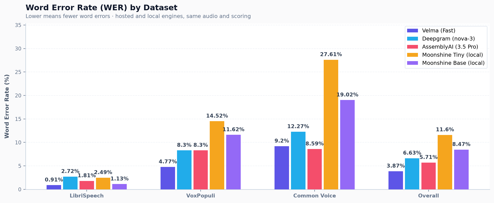
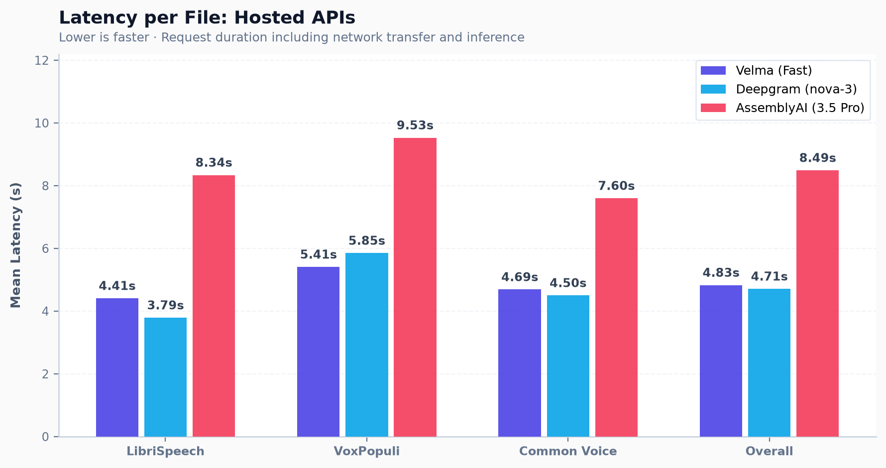
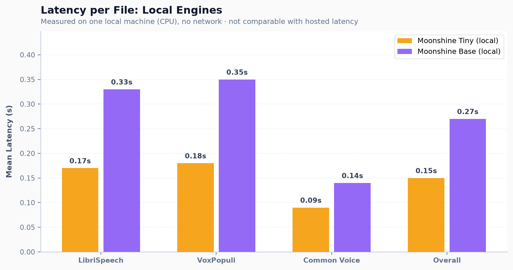
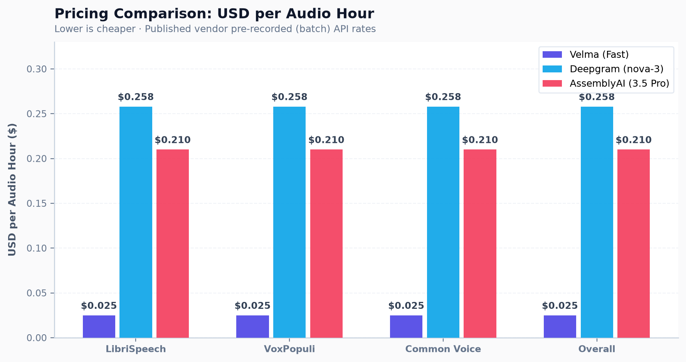

# Speech-to-Text Benchmark: Velma, Deepgram, AssemblyAI, Whisper and Moonshine

A reproducible speech-to-text benchmark for [Modulate's Velma Transcribe](https://www.modulate.ai), [Deepgram](https://deepgram.com), [AssemblyAI](https://www.assemblyai.com), OpenAI Whisper large-v3 through Hugging Face Inference Providers, and the local Moonshine models. It follows the layout of [Picovoice's speech-to-text-benchmark](https://github.com/Picovoice/speech-to-text-benchmark): one CLI, one file per engine, shared scoring, and results and plots checked into the repo.

> The samples are small (20 files and 163 to 482 reference words per dataset), so a difference of one or two words moves WER by about 0.2 to 0.6 points. Read the numbers as indicative, not as a ranking. See [Limitations](#limitations).

## Table of contents

- [Data](#data)
- [Metrics](#metrics)
- [Engines and models](#engines-and-models)
- [Usage](#usage)
- [Results](#results)
- [Text normalisation](#text-normalisation)
- [Adding a new engine](#adding-a-new-engine)
- [Repository layout](#repository-layout)
- [Limitations](#limitations)

## Data

20 English files per dataset. Audio is downloaded on demand into `datasets/audio/` and is **not** committed. The files used are recorded in `datasets/manifests/<dataset>.json` (id, path, reference transcript, duration).

| Dataset | Source | Slice | Audio | Reference words |
|---|---|---|---|---|
| LibriSpeech | `openslr/librispeech_asr`, `clean`, `test` | first 20 | 164 s | 441 |
| VoxPopuli | `facebook/voxpopuli`, `en`, `test` | first 20 | 183 s | 482 |
| Common Voice | `fixie-ai/common_voice_17_0`, `en`, `test` (parquet mirror of Mozilla Common Voice 17) | first 20 | 108 s | 163 |

## Metrics

| Metric | Definition |
|---|---|
| WER | Word error rate with [`jiwer`](https://github.com/jitsi/jiwer), computed over the whole slice (total errors divided by total reference words) after [normalisation](#text-normalisation). |
| Latency | Wall-clock seconds for one request including upload from the test machine and any server-side wait. The table reports the mean and median per-file latency. Batch latency, not streaming latency. |
| USD per audio hour | The vendor's published price for the model used. A price lookup, not a measurement. |

How latency is measured per engine:
- **Whisper via Hugging Face:** one routed call. One untimed warm-up call (a 2.9 s LibriSpeech clip) is made before measuring so a cold start is not counted. The audio file is read from disk before the timer starts.
- **Moonshine (local):** wall-clock time from decoded audio to decoded text on the test machine (feature extraction, generation, token decoding). Model loading and one untimed warm-up call are excluded. No network is involved.
- **Velma and Deepgram:** one HTTP request. The timer covers sending the file and receiving the transcript.
- **AssemblyAI:** a three-step flow (upload, submit, poll every 0.25 s). The timer starts before the upload and stops when the status is `completed`, so it covers all three steps and is comparable with the single-call engines. The submit-to-final time is stored in the raw response but is not what the table reports.

## Engines and models

| Engine | File | Model used | Settings | USD per audio hour | Price source |
|---|---|---|---|---|---|
| Velma Transcribe | `engines/velma.py` | `velma-2-stt-batch-english-vfast` (English Fast) | none | 0.025 | [modulate.ai/api-pricing](https://www.modulate.ai/api-pricing) |
| Deepgram | `engines/deepgram.py` | `nova-3` | `language=en`, `smart_format=true` | 0.258 ($0.0043 per minute) | [deepgram.com/pricing](https://deepgram.com/pricing) |
| AssemblyAI | `engines/assemblyai.py` | `universal-3-5-pro` (`speech_models`), reported back as `speech_model_used` | `language_code=en` | 0.21 | [assemblyai.com/pricing](https://www.assemblyai.com/pricing) |
| Whisper large-v3 via Hugging Face (DeepInfra) | `engines/whisper_hf.py` | `openai/whisper-large-v3`, provider `deepinfra` through Hugging Face Inference Providers | untimed warm-up call; audio read before the timer | 0.027 ($0.00045 per minute) | [deepinfra.com](https://deepinfra.com/openai/whisper-large-v3), passed through by [Hugging Face](https://huggingface.co/docs/inference-providers/pricing) without markup |
| Moonshine Tiny (local) | `engines/moonshine_local.py` | `moonshine-ai/moonshine-tiny` (MIT) | Transformers, CPU, float32 | 0 (no API charge, local compute not counted) | not applicable |
| Moonshine Base (local) | `engines/moonshine_local.py` | `moonshine-ai/moonshine-base` (MIT) | Transformers, CPU, float32 | 0 (no API charge, local compute not counted) | not applicable |
| Slot A, Slot B | `engines/slot_a.py`, `slot_b.py` | not configured | | | |

Each model is the vendor's current recommended or default general-purpose English model as given in its docs on the test date. Prices are the pay-as-you-go pre-recorded (batch) rates read from the vendors' pricing pages on 2026-10-05 and 2026-10-06, and plans differ.

API references: [Velma](https://docs.modulate.ai/api-reference/stt/batch-english-vfast), [Deepgram](https://developers.deepgram.com/docs/pre-recorded-audio), [AssemblyAI](https://www.assemblyai.com/docs/getting-started/transcribe-an-audio-file). All wrappers retry transient errors (408, 429 and 5xx) with exponential backoff.

Whisper large-v3 is served through Hugging Face Inference Providers. Groq is not a provider for this model on Hugging Face. DeepInfra is, and it publishes a per-minute price, so it is the provider used. Whisper latency depends on the provider as well as the model, because the call goes through the Hugging Face router to DeepInfra. DeepInfra's page mentions a minimum charge per request without stating the amount, so cost for very short clips may be slightly higher than the per-minute rate.

Moonshine models run locally on the test machine, so they are listed in a separate table and their latency is not comparable with hosted APIs (see [Results](#results)). The models differ in size and purpose: Moonshine is a small on-device model family (the checkpoints are 110 MB and 248 MB), while the hosted engines are server-side services.

Language is set to English for Deepgram and AssemblyAI. In an early test AssemblyAI with automatic language detection returned Slovenian text for English VoxPopuli audio, so the language is pinned for fairness with the English-only Velma model.

## Usage

```bash
git clone https://github.com/Infrasity-Labs/modulate-repo-1 && cd modulate-repo-1
python3.11 -m venv .venv && source .venv/bin/activate   # Python 3.10 or newer
pip install -r requirements.txt
cp .env.example .env     # set VELMA_API_KEY, DEEPGRAM_API_KEY, ASSEMBLYAI_API_KEY, HF_TOKEN
```

Keys are read from the environment only. `.env` is git-ignored. Never commit keys.

```bash
# 1. fetch the data slices (audio is git-ignored, manifests are committed)
python download_datasets.py --dataset all --num-files 20

# 2. run all engines in one session, 3 repeats per file
python benchmark.py --engine velma deepgram assemblyai --dataset all --num-files 20 --repeats 3

# 2b. hosted Whisper large-v3 (needs HF_TOKEN with Inference Providers permission and credits)
python benchmark.py --engine whisper_hf --dataset all --num-files 20 --repeats 3

# 2c. local Moonshine (downloads the model weights from the Hub on first use, no token needed)
python benchmark.py --engine moonshine_tiny moonshine_base --dataset all --num-files 20 --repeats 3

# 3. rebuild the tables and plots from results/session.json
python benchmark.py --report

# tests (fake text, no API needed)
python -m pytest
```

| Flag | Meaning |
|---|---|
| `--engine` | one or more of `velma`, `deepgram`, `assemblyai`, `whisper_hf`, `moonshine_tiny`, `moonshine_base`, `slot_a`, `slot_b` |
| `--dataset` | `librispeech`, `voxpopuli`, `commonvoice`, or `all` |
| `--num-files` | files per dataset from the manifest (default 20) |
| `--repeats` | calls per file, latency is averaged (default 3) |
| `--model ENGINE=MODEL` | override a model, for example `velma=multilingual` |
| `--report` | regenerate `results/results.csv`, `results/results.md` and `results/plots/` |

How a session works: engines are called one after another for each file, so all engines see similar network conditions. Every call is cached in `results/call_cache.jsonl` (git-ignored), so an interrupted run resumes where it stopped. If any engine fails on a file after retries, the file is excluded for every engine and the count is shown in the results. If Hugging Face returns 401, 402 or 403 (bad token, missing permission or credits exhausted) the run stops, keeps the cached calls, and resumes when you rerun the same command. Running new engines adds them to `results/session.json` without changing the engines already recorded. To start a fresh run of an engine that is already recorded, delete `results/call_cache.jsonl` and `results/session.json`. Close other applications during a local (Moonshine) run, since its latency depends on machine load.

## Results

Test run on macOS (Darwin 25.3), Python 3.9 over a consumer internet connection. Test location (city or region): _to be filled in._ Every file succeeded for every engine, so 0 files were excluded.

| Dataset | Engine | Model | Files | Excluded | WER % | Mean latency (s) | Median latency (s) | USD per audio hour |
|---|---|---|---|---|---|---|---|---|
| librispeech | velma | english-fast | 20 | 0 | 0.91 | 4.41 | 3.63 | 0.025 |
| librispeech | deepgram | nova-3 | 20 | 0 | 2.72 | 3.79 | 2.78 | 0.258 |
| librispeech | assemblyai | universal-3-5-pro | 20 | 0 | 1.81 | 8.34 | 6.68 | 0.21 |
| voxpopuli | velma | english-fast | 20 | 0 | 4.77 | 5.41 | 4.58 | 0.025 |
| voxpopuli | deepgram | nova-3 | 20 | 0 | 8.3 | 5.85 | 3.91 | 0.258 |
| voxpopuli | assemblyai | universal-3-5-pro | 20 | 0 | 8.3 | 9.53 | 7.02 | 0.21 |
| commonvoice | velma | english-fast | 20 | 0 | 9.2 | 4.69 | 3.93 | 0.025 |
| commonvoice | deepgram | nova-3 | 20 | 0 | 12.27 | 4.5 | 4.52 | 0.258 |
| commonvoice | assemblyai | universal-3-5-pro | 20 | 0 | 8.59 | 7.6 | 7.59 | 0.21 |
| overall | velma | english-fast | 60 | 0 | 3.87 | 4.83 | 4.0 | 0.025 |
| overall | deepgram | nova-3 | 60 | 0 | 6.63 | 4.71 | 3.72 | 0.258 |
| overall | assemblyai | universal-3-5-pro | 60 | 0 | 5.71 | 8.49 | 7.04 | 0.21 |

### Local engines

Moonshine runs on the test machine, so its latency measures that machine and has no network time. **Do not compare it with the hosted latency above.** WER can be compared across both tables because the audio files, normalisation and scoring are the same, but the models differ in size and purpose.

Test machine: Apple M1 Pro, 16 GB RAM, macOS 26.3, CPU inference (float32), Python 3.11, PyTorch 2.14, Transformers 5.18. Run on 2026-10-06 with each call repeated 3 times, 60 files per model, 0 files excluded.

| Dataset | Engine | Model | Files | Excluded | WER % | Mean latency (s) | Median latency (s) | USD per audio hour |
|---|---|---|---|---|---|---|---|---|
| librispeech | moonshine_tiny | moonshine-ai/moonshine-tiny | 20 | 0 | 2.49 | 0.17 | 0.13 | 0.0 |
| librispeech | moonshine_base | moonshine-ai/moonshine-base | 20 | 0 | 1.13 | 0.33 | 0.25 | 0.0 |
| voxpopuli | moonshine_tiny | moonshine-ai/moonshine-tiny | 20 | 0 | 14.52 | 0.18 | 0.19 | 0.0 |
| voxpopuli | moonshine_base | moonshine-ai/moonshine-base | 20 | 0 | 11.62 | 0.35 | 0.4 | 0.0 |
| commonvoice | moonshine_tiny | moonshine-ai/moonshine-tiny | 20 | 0 | 27.61 | 0.09 | 0.08 | 0.0 |
| commonvoice | moonshine_base | moonshine-ai/moonshine-base | 20 | 0 | 19.02 | 0.14 | 0.14 | 0.0 |
| overall | moonshine_tiny | moonshine-ai/moonshine-tiny | 60 | 0 | 11.6 | 0.15 | 0.11 | 0.0 |
| overall | moonshine_base | moonshine-ai/moonshine-base | 60 | 0 | 8.47 | 0.27 | 0.19 | 0.0 |

Machine-readable: [`results/results.csv`](results/results.csv), [`results/results.md`](results/results.md), [`results/session.json`](results/session.json). Per-file transcripts, references and latencies: `results/<engine>_<dataset>.json`.

### Word error rate



### Latency (hosted APIs)



### Latency (local engines, this machine only)



### Cost per audio hour



### Notes on the numbers

- **One Common Voice clip is unusable.** For `commonvoice_010` (reference "I guess you must think I'm kinda Batty.") all three engines fail differently: Velma returned "Russians can't handle Bhakti.", Deepgram returned an empty transcript, and AssemblyAI returned "question was written on the paper". This points to a problem with the clip or its reference, not with one engine. It is kept in the tables because exclusion is only applied to engine failures. Without it, Common Voice WER is 5.16 for Velma, 7.74 for Deepgram and 3.87 for AssemblyAI, and overall WER is 3.15, 5.94 and 5.01.
- **Latency varies with network conditions.** Latency includes upload from the test machine and depends on network conditions and server load at the time.
- **Part of the WER is reference style, not recognition.** LibriSpeech references contain "to day" and "to morrow", while Deepgram and AssemblyAI write "today" and "tomorrow". AssemblyAI wrote "2010" for the spoken "two thousand and ten", which the number rule renders without "and". Neither engine is wrong about the audio.
- **Contractions and possessives.** All engines drop the possessive in "country's" and "master's" in one LibriSpeech file, and "all's" against "all is" counts as an error for engines that write the latter.
- **No empty outputs** except Deepgram on `commonvoice_010`. No wrong-language output after language was pinned.
- **Moonshine empty outputs.** Moonshine Base returned an empty transcript for two Common Voice files (`commonvoice_002`, the single word "Six", and `commonvoice_007`). Moonshine Tiny returned text for all 60 files. These count as full errors.
- **Moonshine Common Voice WER is dominated by short clips.** Common Voice has very short utterances, and a single wrong word in a 3 to 5 word clip is a large share of the 163 reference words.
- **Common Voice has only 163 reference words.** One word is 0.6 WER points.

## Text normalisation

Every engine's output and every reference passes through `scoring/normalize.py` before scoring. Rules, in order:

1. Unicode NFKC, then lowercase.
2. Curly apostrophes become straight apostrophes.
3. Bracketed or angle-bracket markers such as `[laughter]` are removed.
4. `%` becomes "percent" and `&` becomes "and".
5. Digits become words with `num2words` (`3` to "three", `2nd` to "second", `1,000` to "one thousand", `2.5` to "two point five").
6. Hyphens split words (`well-known` to "well known").
7. All other punctuation is removed. Apostrophes inside words are kept.
8. Whitespace is collapsed.
9. British spellings become American using the spelling map from the [`whisper-normalizer`](https://pypi.org/project/whisper-normalizer/) package (`travellers` to "travelers", `honour` to "honor").

Change log: rule 9 was added after the fairness check on 2026-10-05. On five test files, Deepgram and AssemblyAI returned American spellings while the VoxPopuli references use British ones, which counted against those two engines only. All results in this README use rule 9.

Pairs with an empty reference are dropped. An empty hypothesis counts as all deletions. No engine-specific cleanup is allowed. The fairness check found no speaker labels, filler-word markup or leftover digits in any engine's output after normalisation.

## Adding a new engine

1. Open the placeholder in `engines/` or copy `engines/velma.py`.
2. Subclass `Engine`, set `name` and `price_per_hour` (USD per audio hour from the vendor's published price, or `None` if unknown), read the key from the environment, and implement `transcribe(audio_path)` returning a `Transcription` (text and measured latency).
3. Register the class in `engines/__init__.py`.
4. Add the key name to `.env.example` and set it in your `.env`.
5. Run all engines together so the comparison stays in one session: `python benchmark.py --engine velma deepgram assemblyai <name> --dataset all --repeats 3`. Delete `results/call_cache.jsonl` and `results/session.json` first for a fresh session.

## Repository layout

```
benchmark.py            single CLI entry point (run and report)
download_datasets.py    downloads slices and writes manifests
engines/                base.py plus one file per engine (whisper_hf.py hosted, moonshine_local.py local)
scoring/                normalize.py and wer.py, shared by all engines
tests/                  unit tests on fake text
datasets/manifests/     files used (audio is git-ignored)
results/                results.csv, results.md, session.json, per-file JSON
results/plots/          wer.png, latency.png, latency_local.png, cost_per_hour.png
```

## Limitations

- Small samples: 20 files and 163 to 482 reference words per dataset. One word changes WER by about 0.2 to 0.6 points, and the differences between engines on a single dataset are often a handful of words.
- One machine and one network. Latency reflects the conditions at the time each engine was measured and includes upload from the test machine and server-side load for hosted engines.
- Common Voice comes from a third-party Hugging Face mirror, not Mozilla's own distribution, and one clip in it is unusable.
- English only. The first 20 files of each split are used, not a random sample.
- Each engine is run with one model and one setting. Other models, settings (for example Deepgram without `smart_format`) and plans may behave differently and are priced differently.
- The normaliser does not expand contractions, does not unify compound words such as "today" and "to day", and renders numbers without British "and".
- The Velma docs do not state rate limits.
