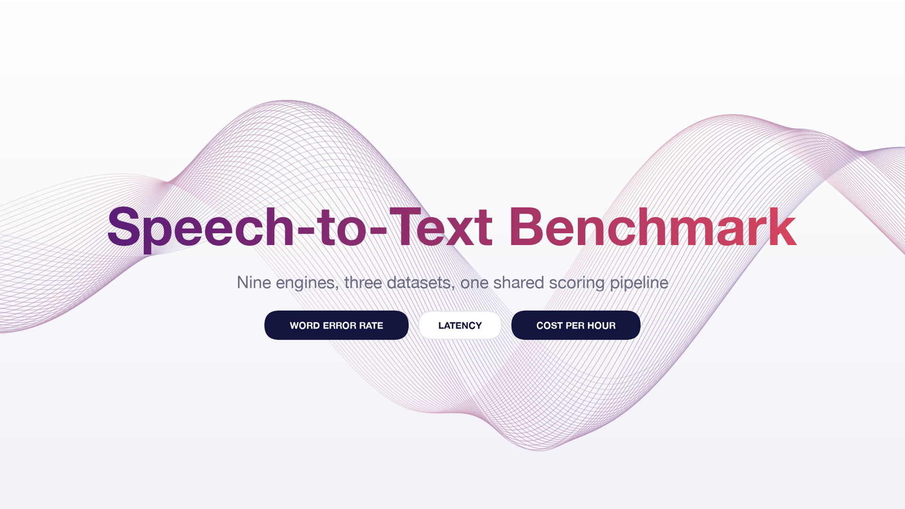
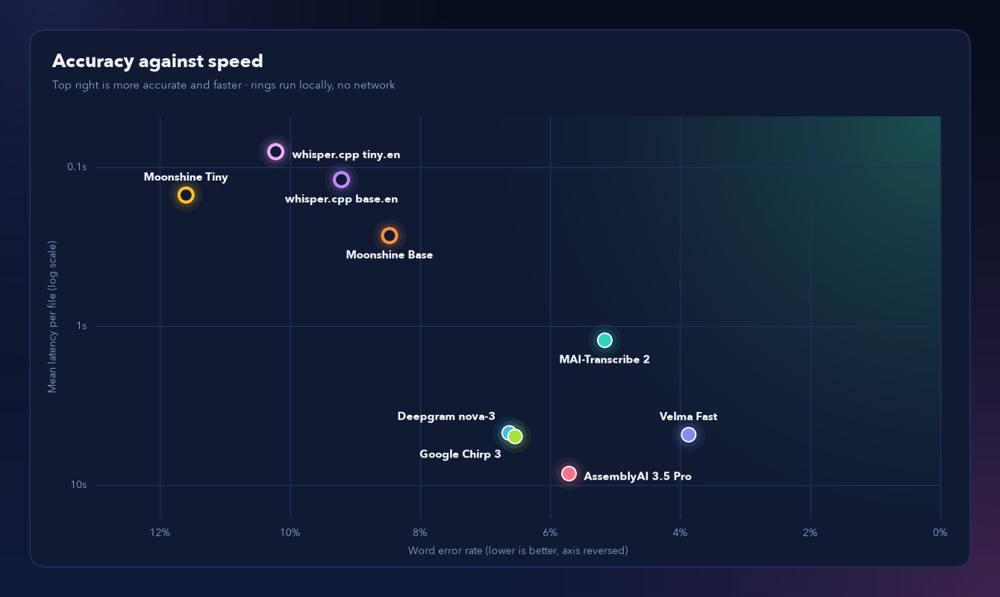

<p align="center">
  
</p>

# Speech-to-Text Benchmark

A reproducible comparison of nine speech-to-text engines on the same audio with the same scoring: Velma Transcribe, Deepgram, AssemblyAI, Google Chirp 3 and Microsoft MAI-Transcribe 2 (hosted), and Moonshine and whisper.cpp (local). The layout follows [Picovoice's speech-to-text-benchmark](https://github.com/Picovoice/speech-to-text-benchmark): one CLI, one file per engine, shared scoring, and results and plots checked into the repo.

> The samples are small (20 files and 163 to 482 reference words per dataset), so a difference of one or two words moves WER by about 0.2 to 0.6 points. Read the numbers as indicative, not as a ranking.

## Table of contents

- [Data](#data)
- [Metrics](#metrics)
- [Engines and models](#engines-and-models)
- [Usage](#usage)
- [Results](#results)
- [Text normalisation](#text-normalisation)
- [Repository layout](#repository-layout)
- [Limitations](#limitations)

## Data

20 English files per dataset. Audio is downloaded on demand into `datasets/audio/` and is not committed. The files used are listed in `datasets/manifests/<dataset>.json`.

| Dataset | Source | Slice | Audio | Reference words |
|---|---|---|---|---|
| LibriSpeech | `openslr/librispeech_asr`, `clean`, `test` | first 20 | 164 s | 441 |
| VoxPopuli | `facebook/voxpopuli`, `en`, `test` | first 20 | 183 s | 482 |
| Common Voice | `fixie-ai/common_voice_17_0`, `en`, `test` (parquet mirror of Common Voice 17) | first 20 | 108 s | 163 |

## Metrics

| Metric | Definition |
|---|---|
| WER | Word error rate with [`jiwer`](https://github.com/jitsi/jiwer) over the whole slice, after [normalisation](#text-normalisation). |
| Latency | Wall-clock seconds per file, reported as the mean and median over files. Hosted APIs include upload and server time. Local engines run on the test machine with no network. AssemblyAI is timed from the start of the upload to the finished transcript. |
| USD per audio hour | The vendor's published batch price for the model used. |

Velma, Deepgram and AssemblyAI are called 3 times per file and the latencies averaged. Chirp 3 and MAI-Transcribe 2 are called 2 times per file.

## Engines and models

| Engine | File | Model | Settings | USD per audio hour |
|---|---|---|---|---|
| Velma Transcribe | `engines/velma.py` | `velma-2-stt-batch-english-vfast` | none | 0.025 ([pricing](https://www.modulate.ai/api-pricing)) |
| Deepgram | `engines/deepgram.py` | `nova-3` | `language=en`, `smart_format=true` | 0.258 ([pricing](https://deepgram.com/pricing)) |
| AssemblyAI | `engines/assemblyai.py` | `universal-3-5-pro` | `language_code=en` | 0.21 ([pricing](https://www.assemblyai.com/pricing)) |
| Google Chirp 3 | `engines/openrouter_stt.py` | `google/chirp-3` via OpenRouter | `language=en` | 0.961 ([pricing](https://openrouter.ai/google/chirp-3)) |
| MAI-Transcribe 2 | `engines/openrouter_stt.py` | `microsoft/mai-transcribe-2` via OpenRouter | `language=en` | 0.10 ([pricing](https://openrouter.ai/microsoft/mai-transcribe-2)) |
| Moonshine Tiny | `engines/moonshine_local.py` | `moonshine-ai/moonshine-tiny`, local | Transformers, CPU | 0 |
| Moonshine Base | `engines/moonshine_local.py` | `moonshine-ai/moonshine-base`, local | Transformers, CPU | 0 |
| whisper.cpp tiny.en | `engines/whisper_cpp_local.py` | `ggml-tiny.en.bin`, local | `whisper-server`, Metal | 0 |
| whisper.cpp base.en | `engines/whisper_cpp_local.py` | `ggml-base.en.bin`, local | `whisper-server`, Metal | 0 |

Hosted prices are pay-as-you-go batch rates from the vendors' pricing pages (October 2026). Local engines have no API charge; local compute is not counted.

API references: [Velma](https://docs.modulate.ai/api-reference/stt/batch-english-vfast), [Deepgram](https://developers.deepgram.com/docs/pre-recorded-audio), [AssemblyAI](https://www.assemblyai.com/docs/getting-started/transcribe-an-audio-file), [OpenRouter](https://openrouter.ai/docs/guides/overview/multimodal/stt).

## Usage

```bash
git clone https://github.com/Infrasity-Labs/modulate-repo-1 && cd modulate-repo-1
python3.11 -m venv .venv && source .venv/bin/activate   # Python 3.10 or newer
pip install -r requirements.txt
cp .env.example .env     # set VELMA_API_KEY, DEEPGRAM_API_KEY, ASSEMBLYAI_API_KEY, OPENROUTER_API_KEY
```

Keys are read from the environment only. `.env` is git-ignored.

```bash
# 1. fetch the data slices (audio is git-ignored, manifests are committed)
python download_datasets.py --dataset all --num-files 20

# 2. run the engines
python benchmark.py --engine velma deepgram assemblyai --dataset all --num-files 20 --repeats 3
python benchmark.py --engine chirp_3 mai_transcribe_2 --dataset all --num-files 20 --repeats 2
python benchmark.py --engine moonshine_tiny moonshine_base --dataset all --num-files 20 --repeats 3

# local whisper.cpp: build it once, then set WHISPER_CPP_DIR in .env
git clone https://github.com/ggml-org/whisper.cpp && cd whisper.cpp
cmake -B build && cmake --build build -j --config Release
sh ./models/download-ggml-model.sh tiny.en && sh ./models/download-ggml-model.sh base.en
cd .. && python benchmark.py --engine whisper_cpp_tiny whisper_cpp_base --dataset all --num-files 20 --repeats 3

# 3. rebuild the tables and charts from results/session.json
python benchmark.py --report

# tests (fake text, no API needed)
python -m pytest
```

| Flag | Meaning |
|---|---|
| `--engine` | one or more engine names, for example `velma deepgram` |
| `--dataset` | `librispeech`, `voxpopuli`, `commonvoice`, or `all` |
| `--num-files` | files per dataset from the manifest (default 20) |
| `--repeats` | calls per file, latency is averaged (default 3) |
| `--report` | regenerate the tables in `results/` and the charts in `results/plots/` |

Engines are called one after another for each file. Every call is cached in `results/call_cache.jsonl` (git-ignored), so an interrupted run resumes where it stopped. A file that fails on any engine is excluded for every engine in that run and counted in the results. Running new engines adds them to `results/session.json` without changing the engines already recorded. Close other applications during local runs, since their latency depends on machine load.

## Results

Tested in October 2026 on macOS over a consumer internet connection. Test location (city or region): _to be filled in._

### Hosted APIs

| Dataset | Engine | Model | Files | Excluded | WER % | Mean latency (s) | Median latency (s) | USD per audio hour |
|---|---|---|---|---|---|---|---|---|
| librispeech | velma | english-fast | 20 | 0 | 0.91 | 4.41 | 3.63 | 0.025 |
| librispeech | deepgram | nova-3 | 20 | 0 | 2.72 | 3.79 | 2.78 | 0.258 |
| librispeech | assemblyai | universal-3-5-pro | 20 | 0 | 1.81 | 8.34 | 6.68 | 0.21 |
| librispeech | chirp_3 | google/chirp-3 | 20 | 0 | 2.04 | 5.13 | 4.58 | 0.961 |
| librispeech | mai_transcribe_2 | microsoft/mai-transcribe-2 | 20 | 0 | 0.91 | 1.37 | 1.24 | 0.1 |
| voxpopuli | velma | english-fast | 20 | 0 | 4.77 | 5.41 | 4.58 | 0.025 |
| voxpopuli | deepgram | nova-3 | 20 | 0 | 8.3 | 5.85 | 3.91 | 0.258 |
| voxpopuli | assemblyai | universal-3-5-pro | 20 | 0 | 8.3 | 9.53 | 7.02 | 0.21 |
| voxpopuli | chirp_3 | google/chirp-3 | 20 | 0 | 9.13 | 5.47 | 5.04 | 0.961 |
| voxpopuli | mai_transcribe_2 | microsoft/mai-transcribe-2 | 20 | 0 | 7.88 | 1.22 | 1.2 | 0.1 |
| commonvoice | velma | english-fast | 20 | 0 | 9.2 | 4.69 | 3.93 | 0.025 |
| commonvoice | deepgram | nova-3 | 20 | 0 | 12.27 | 4.5 | 4.52 | 0.258 |
| commonvoice | assemblyai | universal-3-5-pro | 20 | 0 | 8.59 | 7.6 | 7.59 | 0.21 |
| commonvoice | chirp_3 | google/chirp-3 | 20 | 0 | 11.04 | 4.28 | 4.37 | 0.961 |
| commonvoice | mai_transcribe_2 | microsoft/mai-transcribe-2 | 20 | 0 | 8.59 | 1.11 | 1.1 | 0.1 |
| overall | velma | english-fast | 60 | 0 | 3.87 | 4.83 | 4.0 | 0.025 |
| overall | deepgram | nova-3 | 60 | 0 | 6.63 | 4.71 | 3.72 | 0.258 |
| overall | assemblyai | universal-3-5-pro | 60 | 0 | 5.71 | 8.49 | 7.04 | 0.21 |
| overall | chirp_3 | google/chirp-3 | 60 | 0 | 6.54 | 4.96 | 4.48 | 0.961 |
| overall | mai_transcribe_2 | microsoft/mai-transcribe-2 | 60 | 0 | 5.16 | 1.23 | 1.13 | 0.1 |

### Local engines

Moonshine and whisper.cpp run on the test machine (Apple M1 Pro, 16 GB RAM, macOS), so their latency has no network time and is not comparable with the hosted latency above. Moonshine runs on the CPU and whisper.cpp (commit `60c0be6`) on the Metal GPU, with 3 repeats per file. WER can be compared across both tables, but the models differ in size and purpose.

| Dataset | Engine | Model | Files | Excluded | WER % | Mean latency (s) | Median latency (s) | USD per audio hour |
|---|---|---|---|---|---|---|---|---|
| librispeech | moonshine_tiny | moonshine-ai/moonshine-tiny | 20 | 0 | 2.49 | 0.17 | 0.13 | 0.0 |
| librispeech | moonshine_base | moonshine-ai/moonshine-base | 20 | 0 | 1.13 | 0.33 | 0.25 | 0.0 |
| librispeech | whisper_cpp_tiny | ggml-tiny.en.bin (whisper.cpp) | 20 | 0 | 3.85 | 0.09 | 0.07 | 0.0 |
| librispeech | whisper_cpp_base | ggml-base.en.bin (whisper.cpp) | 20 | 0 | 3.4 | 0.13 | 0.11 | 0.0 |
| voxpopuli | moonshine_tiny | moonshine-ai/moonshine-tiny | 20 | 0 | 14.52 | 0.18 | 0.19 | 0.0 |
| voxpopuli | moonshine_base | moonshine-ai/moonshine-base | 20 | 0 | 11.62 | 0.35 | 0.4 | 0.0 |
| voxpopuli | whisper_cpp_tiny | ggml-tiny.en.bin (whisper.cpp) | 20 | 0 | 11.0 | 0.09 | 0.1 | 0.0 |
| voxpopuli | whisper_cpp_base | ggml-base.en.bin (whisper.cpp) | 20 | 0 | 10.17 | 0.14 | 0.14 | 0.0 |
| commonvoice | moonshine_tiny | moonshine-ai/moonshine-tiny | 20 | 0 | 27.61 | 0.09 | 0.08 | 0.0 |
| commonvoice | moonshine_base | moonshine-ai/moonshine-base | 20 | 0 | 19.02 | 0.14 | 0.14 | 0.0 |
| commonvoice | whisper_cpp_tiny | ggml-tiny.en.bin (whisper.cpp) | 20 | 0 | 25.15 | 0.06 | 0.06 | 0.0 |
| commonvoice | whisper_cpp_base | ggml-base.en.bin (whisper.cpp) | 20 | 0 | 22.09 | 0.09 | 0.09 | 0.0 |
| overall | moonshine_tiny | moonshine-ai/moonshine-tiny | 60 | 0 | 11.6 | 0.15 | 0.11 | 0.0 |
| overall | moonshine_base | moonshine-ai/moonshine-base | 60 | 0 | 8.47 | 0.27 | 0.19 | 0.0 |
| overall | whisper_cpp_tiny | ggml-tiny.en.bin (whisper.cpp) | 60 | 0 | 10.22 | 0.08 | 0.06 | 0.0 |
| overall | whisper_cpp_base | ggml-base.en.bin (whisper.cpp) | 60 | 0 | 9.21 | 0.12 | 0.1 | 0.0 |

Machine-readable: [`results/results.csv`](results/results.csv), [`results/results.md`](results/results.md), [`results/session.json`](results/session.json). Per-file transcripts and latencies: `results/<engine>_<dataset>.json`.

### Charts

A filled dot marks a hosted API and a ring marks a local engine; local engines also show their model size on disk.





Per dataset: [`wer_by_dataset.png`](results/plots/wer_by_dataset.png) and [`latency_by_dataset.png`](results/plots/latency_by_dataset.png).

### Notes

- `commonvoice_010` ("I guess you must think I'm kinda Batty.") is unintelligible and every engine fails on it. It stays in the tables.
- Part of the WER comes from reference style, for example LibriSpeech writes "to day" where most engines write "today".
- Moonshine Base returned an empty transcript for two very short Common Voice clips.
- Common Voice has only 163 reference words, so one word is 0.6 WER points.
- Latency depends on network conditions and server load at the time of the run.

## Text normalisation

Every engine's output and every reference passes through `scoring/normalize.py` before scoring. Rules, in order:

1. Unicode NFKC, then lowercase.
2. Curly apostrophes become straight apostrophes.
3. Bracketed or angle-bracket markers such as `[laughter]` are removed.
4. `%` becomes "percent" and `&` becomes "and".
5. Digits become words with `num2words` (`3` to "three", `2nd` to "second", `1,000` to "one thousand", `2.5` to "two point five").
6. Hyphens split words (`well-known` to "well known").
7. All other punctuation is removed. Apostrophes inside words are kept.
8. Whitespace is collapsed.
9. British spellings become American using the spelling map from the [`whisper-normalizer`](https://pypi.org/project/whisper-normalizer/) package (`travellers` to "travelers", `honour` to "honor").

Pairs with an empty reference are dropped, and an empty output counts as all deletions. No engine-specific cleanup is applied.

## Repository layout

```
.
├── assets/
│   └── banner.png             Repository banner
├── datasets/
│   └── manifests/             Files used per dataset (audio is git-ignored)
├── engines/                   One file per engine
│   ├── base.py                Engine base class
│   ├── velma.py
│   ├── deepgram.py
│   ├── assemblyai.py
│   ├── openrouter_stt.py      Chirp 3 and MAI-Transcribe 2 (hosted)
│   ├── whisper_hf.py          Whisper large-v3 via Hugging Face (hosted)
│   ├── moonshine_local.py     Moonshine tiny and base (local)
│   ├── whisper_cpp_local.py   whisper.cpp tiny.en and base.en (local)
│   ├── audio_utils.py         16 kHz WAV conversion
│   └── slot_a.py, slot_b.py   Empty slots for more engines
├── results/
│   ├── plots/                 Charts (per metric and per dataset)
│   ├── results.csv            Summary table
│   ├── results.md             Summary tables, hosted and local
│   ├── session.json           Models, prices and run details
│   └── <engine>_<dataset>.json  Per-file transcripts and latencies
├── scoring/
│   ├── normalize.py           Shared text normalisation
│   └── wer.py                 WER with jiwer
├── tests/                     Unit tests on fake text
├── benchmark.py               CLI: run engines, rebuild reports
├── download_datasets.py       Download slices, write manifests
├── plots.py                   Charts and banner used by --report
├── requirements.txt
└── .env.example               API key names (copy to .env)
```

## Limitations

- Small samples: 20 files per dataset, so a single file can move WER noticeably.
- One machine and one network. Latency includes upload time and server load for hosted engines.
- Common Voice comes from a third-party Hugging Face mirror, not Mozilla's own distribution.
- English only, and the first 20 files of each split rather than a random sample.
- Each engine is run with one model and one setting.
- The normaliser does not expand contractions or join split words such as "to day".
